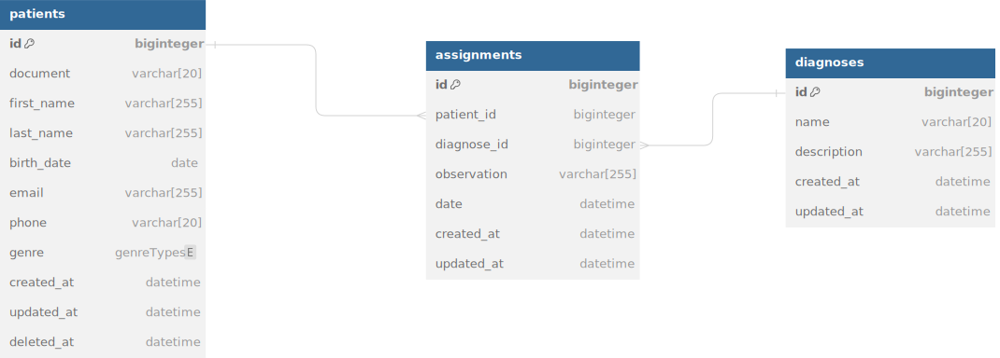

<p align="center"><a href="https://laravel.com" target="_blank"></a></p>

<p align="center">
<a href="https://travis-ci.org/laravel/framework"></a>
<a href="https://packagist.org/packages/laravel/framework"></a>
<a href="https://packagist.org/packages/laravel/framework"></a>
<a href="https://packagist.org/packages/laravel/framework"></a>
</p>

# Hopital NApps
Bienvenido a la API para la gestión de pacientes del Hospital XYZ. Esta API permite a los médicos del hospital buscar pacientes, crear nuevos registros de pacientes y agregar diagnósticos a los pacientes existentes.

## Tecnologías
- Laravel
- Docker

# Esquema DB


# Documentación
<a href="https://documenter.getpostman.com/view/2104738/2sA3JNcgnX"> Ir a postman</a>

## Instalación
Estos pasos asumen que se tiene docker instalado en la maquina

 ```bash
docker run --rm \
    -u "$(id -u):$(id -g)" \
    -v "$(pwd):/var/www/html" \
    -w /var/www/html \
    laravelsail/php83-composer:latest \
    composer install --ignore-platform-reqs
 ```
- cp .env.example .env
- vendor/bin/sail up -d
- vendor/bin/sail php artisan key:generate
- vendor/bin/sail php artisan migrate --seed

## Credenciales
apiToken: GgFjt0EkDfieG1Kc7EvYl9AZU6ND7q3v
